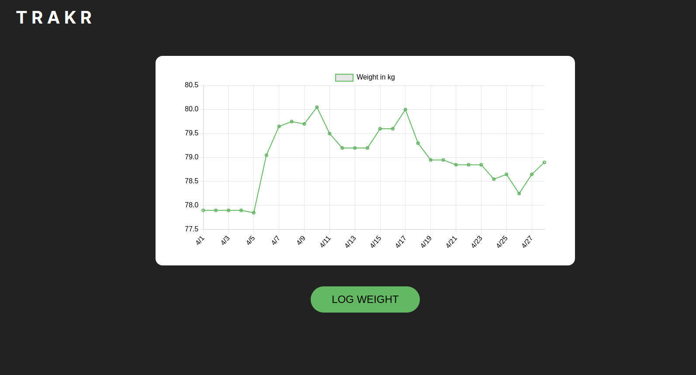

# Weight Tracker

This is a side project to display all my weights stored in my note.

## Table of contents

-   [Overview](#overview)
    -   [The challenge](#the-challenge)
    -   [Screenshot](#screenshot)
    -   [Links](#links)
-   [My process](#my-process)
    -   [Built with](#built-with)
    -   [What I learned](#what-i-learned)
    -   [Continued development](#continued-development)
    -   [Useful resources](#useful-resources)
-   [Author](#author)
-   [Acknowledgments](#acknowledgments)

## Overview

### The challenge

1. Creating responsive design
2. Using Node.js as backend
3. Using MySQL for database
4. Insert / update / display MySQL data
5. Creating "smooth" experience
6. Asynchronous chart data loading

### Screenshot



### Links

⛔ No live link ⛔

Reason:  
No free PaaS that can deploy Node.js with MySQL

## My process

### Built with

-   Semantic HTML5 markup
-   CSS custom properties
-   Mobile-first workflow
-   Javascript
-   Node.js with the following packages:
    -   Express.js
    -   MySQL
    -   Dotenv

### What I learned

1. Learnt new framework

    - My first time ever learning new framework: Chart.js!

2. Learnt the basics of Node.js

    - Learnt how to install packages and use them properly
    - Learnt how to interact with local files
    - Learnt easier way to do GET & POST request through Express.js

3. Communication with MySQL

4. Managing package with npm

```bash
npm install
npm install -g nodemon
nodemon app
```

### Continued development

The hardest part of this project is incorporating Node.js.
By hard, I mean there are a lot of things I need to learn to use it well.
The package itself is not necessarily hard.

I think I only scratched the surface of Node.js.
And the way I wrote this project feels like "bootstrap-y" if that makes sense.

I would need to learn and practice more Node.js to really know how I can get this fixed.

### Useful resources

-   [Node.js Crash Course Tutorial](https://www.youtube.com/playlist?list=PL4cUxeGkcC9jsz4LDYc6kv3ymONOKxwBU) - Helped me tremendously with getting familiar with Node.js
-   [MySQL Node.js Express](https://youtu.be/Hej48pi_lOc) - This video introduced me to incorporation of MySQL into the project.

## Author

-   Github - [Beneditus Kent](https://github.com/BenedictusKent)
-   Twitter - [@BenedictusKentt](https://twitter.com/BenedictusKentt)

## Acknowledgments

I wanna thank Net Ninja for his easy-to-understand videos!
